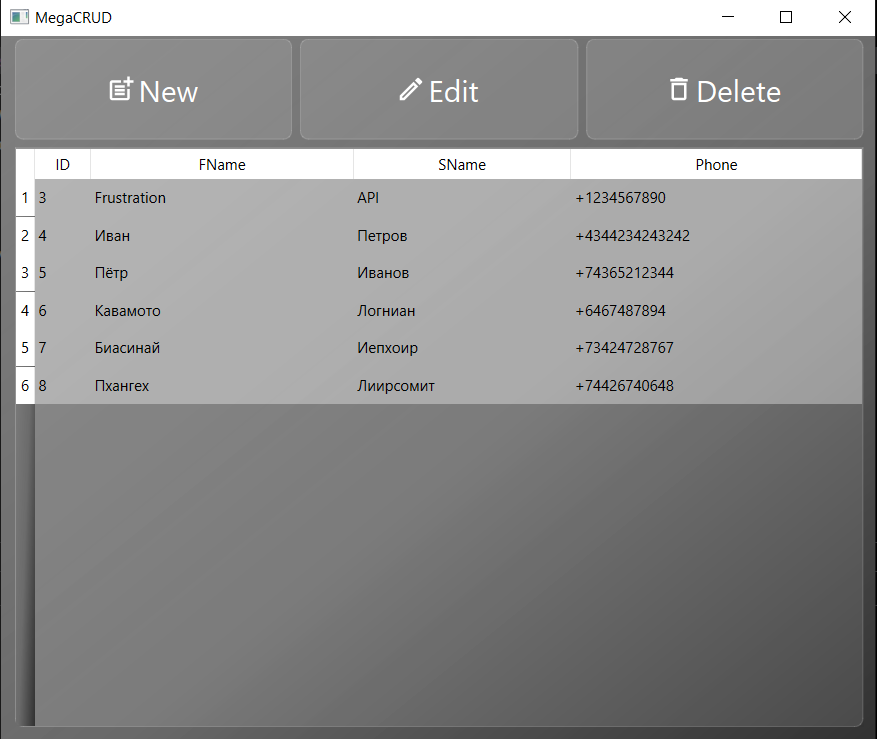
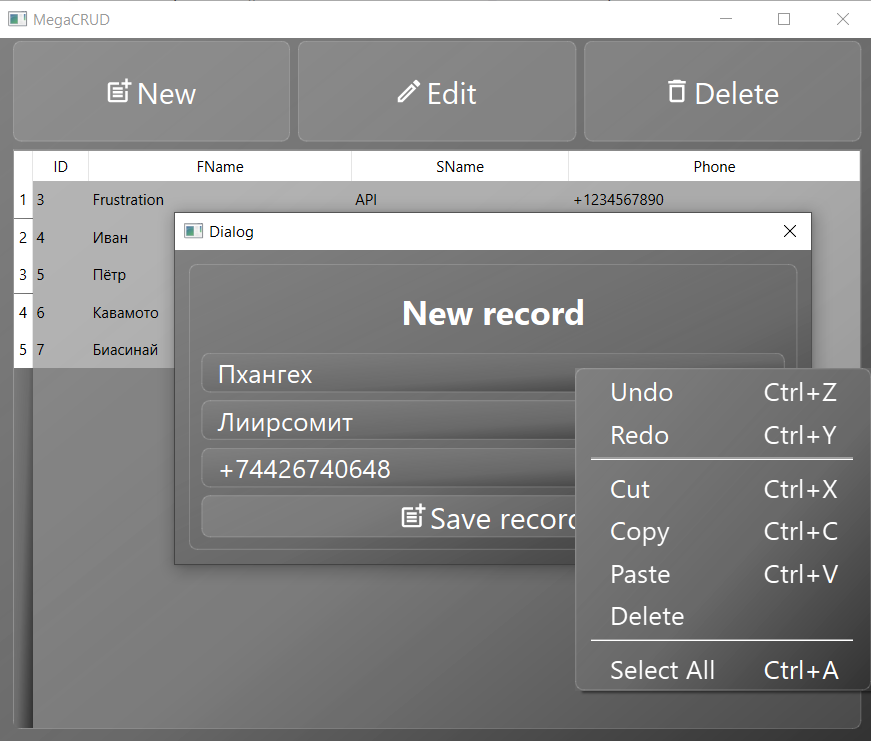

# Домашнее задание к Уроку 2. SQL – создание объектов, простые запросы выборки

1. Используя операторы языка SQL, создайте табличку “sales”. Заполните ее данными
```
CREATE DATABASE IF NOT EXISTS sql_hw2_t1;
USE sql_hw2_t1;

DROP TABLE IF EXISTS sales;

CREATE TABLE sales (
  id INT PRIMARY KEY AUTO_INCREMENT,
  order_date DATE,
  count_product INT
);

INSERT INTO sales (order_date, count_product)
VALUES ('2022-01-01', 156),
       ('2022-01-02', 180),
       ('2022-01-03', 21),
       ('2022-01-04', 124),
       ('2022-01-05', 341);
```
2. Сгруппируйте значения количества в 3 сегмента — меньше 100, 100-300 и больше 300
```
SELECT id, count_product,
	CASE WHEN count_product < 100 THEN 'Less than 100'
		 WHEN count_product BETWEEN 100 AND 300 THEN 'Between 100 and 300'
		 ELSE 'Greater than 300'
	END AS order_type
    FROM sales
    ORDER BY order_type DESC;
```
3. Создайте таблицу “orders”, заполните ее значениями. Покажите “полный” статус заказа, используя оператор CASE
```
CREATE TABLE orders (
  id INT PRIMARY KEY AUTO_INCREMENT,
  employee_id VARCHAR(10),
  amount DECIMAL(10, 2),
  order_status VARCHAR(10)
);

INSERT INTO orders (employee_id, amount, order_status)
VALUES ('e03', 15.00, 'OPEN'),
       ('e01', 25.50, 'OPEN'),
       ('e05', 100.70, 'CLOSED'),
       ('e02', 22.18, 'OPEN'),
       ('e04', 9.50, 'CANCELLED');

SELECT id, employee_id, amount, order_status, 
  CASE 
    WHEN order_status = 'OPEN' THEN 'Order is in open state'
    WHEN order_status = 'CLOSED' THEN 'Order is closed'
    WHEN order_status = 'CANCELLED' THEN 'Order is cancelled'
    ELSE 'Unknown order status'
  END AS full_order_status
FROM orders;
```
## Доп. задание №1 CRUD - операции на любом ЯП. Коннект с БД через С#, к примеру , можно попробовать сделать GUI (WindowsForms, Dear PyGui , PySide или любая другая библиотека).

Test CRUD app on python with GUI on PySide6

[Download EXEcutable](https://github.com/ChistilinMV/megacrud/raw/master/megacrud.exe)

[](./assets/overview.png)

[](./assets/new_record.png)

## Доп. задание №2

№1. Используя оператор ALTER TABLE, установите внешний ключ в одной
из таблиц (clients-posts)
```
ALTER TABLE posts ADD FOREIGN KEY (user_id) REFERENCES clients(id);
```
№2. Без оператора JOIN, верните заголовок публикации, текст с описанием, идентификатор клиента, опубликовавшего публикацию и логин данного клиента.
```
SELECT P.title, P.full_text, P.user_id, C.login
FROM clients AS C, posts AS P
WHERE P.user_id = C.id;
```
№3. Выполните поиск по публикациям, автором которых является клиент "Mikle".
```
SELECT * FROM posts
WHERE user_id = (
    SELECT id
    FROM users
    WHERE login = 'Mikle'
);
```
